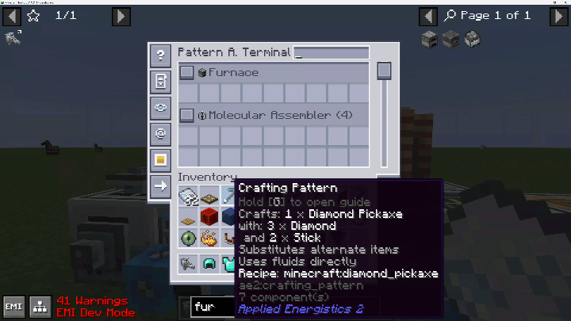
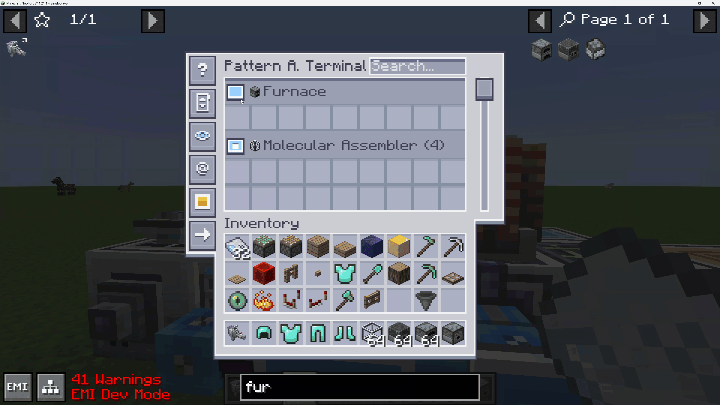

# AE2 Labeled Patterns

## About
A simple mod adds the ability to label pattern providers in Applied Energistics 2, allowing you to organize your patterns in new pattern access terminal.
## Features
- New labeler tool to label any pattern provider.
- New ME pattern access terminal that can display labeled patterns separately according to labels.
- Provide quick move(shift click) ability between pattern slots and player inventory for encoded patterns in new pattern access terminal.

## License
* AE2 Labeled Patterns 
  - 
* Textures and Models
  - 
  - Origin: (c) 2020, [Ridanisaurus Rid](https://github.com/Ridanisaurus/), (c) 2013 - 2020 AlgorithmX2 et al
## Known issues
Currently, cannot apply label to Assembler Matrix of ExtendedAE, so it always shows in terminal representing no label.